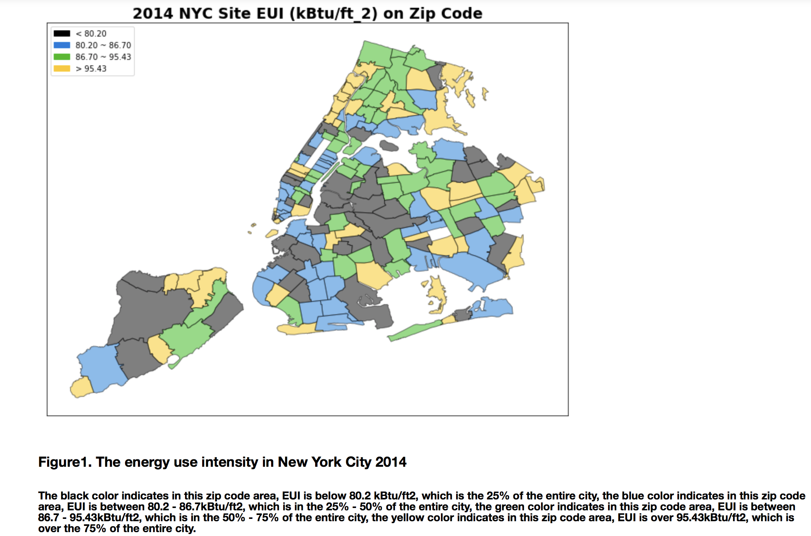

## Review:

#### CLARITY: 
* Title clearly shows the key messages of this map. The numerical range of EUI represented by each color is shown in the legends. Boundaries of the zip code areas are distinctly labeled. 
* the map seems to be slightly compressed in the longitudinal direction, but this does not disturb the conveyance of the major information on the zip-code-wise distribution of site EUI of buildings. 
* A brief definition of Site EUI might be needed if the reader does not have any prior knowledge of building energy terminology. 
* the description would be clearer if 25%, 50%, 75% can be rephrased as first, second and third quartile, and ¡°the entire city¡± as ¡°the Site EUI distribution of the entire city¡±. 

#### AESTHETIC: 
* Since Site EUI is a continuous range, the representation would be more intuitive if the chosen colors are within the same spectrum. For example, the higher EUI values correspond to darker red, lower EUI values with paler red. 
* No exaggerated waste of space. 
* No unnecessary decorative graphic effects. No distractions in the plot. 
#### HONESTY: 
* The plot honestly demonstrates the spatial distribution of Site EUI in New York City in 2014 and no deformation or distortion are done to emphasize a certain feature. 