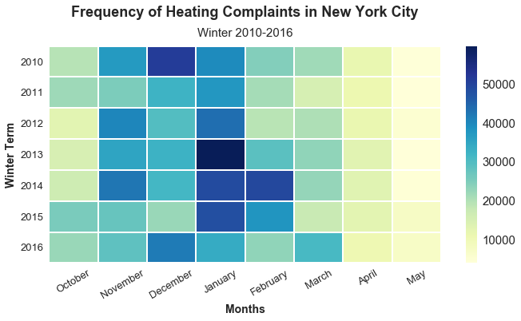

## Ninanrh Plot Review

Dear Nina,

I have reviewed your HW9 plot and here's some viewpoints and suggestions.

* CLARITY: 
In your title I can understand that you want to display the frequency of heating complaints in NYC, especially for winter, however, the range of x axis is a little counfused to me, you started from October and ended to May, from Wikipedia, Winter is often defined to be the 3 months with the lowest average temperatures. This corresponds to the months of December, January and February in the Northern Hemisphere. I suggest present December, January and February only in this plot,if you want to show comparison of complaints increase or decrease, add two more months is enough.

* ESTHETIC: 
I saw you did good job to pick the color of your plot, the dark blue really makes me feel I'm very cold in winter becasue of the poor heating system. From this plot one can easily tell that January suffers highest heating complaints from 2010 - 2016.

* HONESTY: 
After read your notbook, I think this plot honestly reproducing the 311 data from 2010-2016.

Lastly, one suggestions here, add unit or title to the color bar so people can easily tell the meaning of the numbers. In coclusion, this plot is readable and meaningful.

Yixuan Tang
