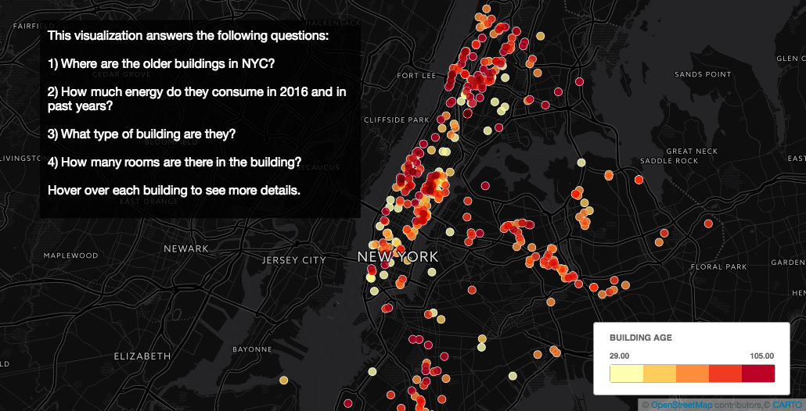

## ianxxiao Plot Review

Click [here](https://ianxxiao.carto.com/viz/0d56359f-68ec-4e61-ae6e-1ae8a8c9ee7e/public_map) to view interactive visualization in Carto

Hi Ian,

Your plot is super cool and I learnt a lot from it! Here's some viewpoints and suggestions.

* CLARITY: 
The legend in your plot clearly guide me what I can read from this map, once I open the carto map and move cursor on each dot, it will automatically presents the location, age, EUI, type and total units of each building.
title I can understand that you want to display the frequency of heating complaints in NYC, especially for winter, however, the range of x axis is a little counfused to me, you started from October and ended to May, from Wikipedia, Winter is often defined to be the 3 months with the lowest average temperatures. This corresponds to the months of December, January and February in the Northern Hemisphere. I suggest present December, January and February only in this plot,if you want to show comparison of complaints increase or decrease, add two more months is enough.

* ESTHETIC: 

I saw you did good job to pick the color of your plot, the dark blue really makes me feel very cold in winter becasue of the poor heating system. From this plot one can easily tell that January suffers highest heating complaints from 2010 - 2016.

* HONESTY: 
After read your notbook, I think this plot honestly reproducing the LL84 and Pluto data 2012-2016.

Lastly, one suggestions is, since you only select the multifamily type building in your dataset, you should clarify that this is a multifamily building map, and remove the guide question "3)What types of buildings are they" in your legend.
In coclusion, this plot is readable and meaningful.

Your classmate,
Yixuan Tang
